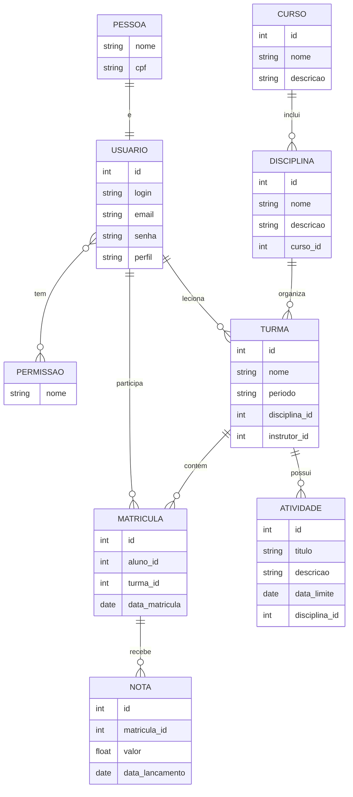

```mermaid
erDiagram

  PESSOA {
    string nome
    string cpf
  }

  PERMISSAO {
    string nome
  }

  USUARIO {
    int id
    string login
    string email
    string senha
    string perfil
  }

  CURSO {
    int id
    string nome
    string descricao
  }

  DISCIPLINA {
    int id
    string nome
    string descricao
    int curso_id
  }

  TURMA {
    int id
    string nome
    string periodo
    int disciplina_id
    int instrutor_id
  }

  MATRICULA {
    int id
    int aluno_id
    int turma_id
    date data_matricula
  }

  NOTA {
    int id
    int matricula_id
    float valor
    date data_lancamento
  }

  ATIVIDADE {
    int id
    string titulo
    string descricao
    date data_limite
    int disciplina_id
  }

  PESSOA ||--|| USUARIO : e

  USUARIO ||--o{ MATRICULA : participa
  USUARIO ||--o{ TURMA : leciona
  USUARIO }o--o{ PERMISSAO : tem

  CURSO ||--o{ DISCIPLINA : inclui
  DISCIPLINA ||--o{ TURMA : organiza

  TURMA ||--o{ MATRICULA : contem
  TURMA ||--o{ ATIVIDADE : possui
  MATRICULA ||--o{ NOTA : recebe
```
