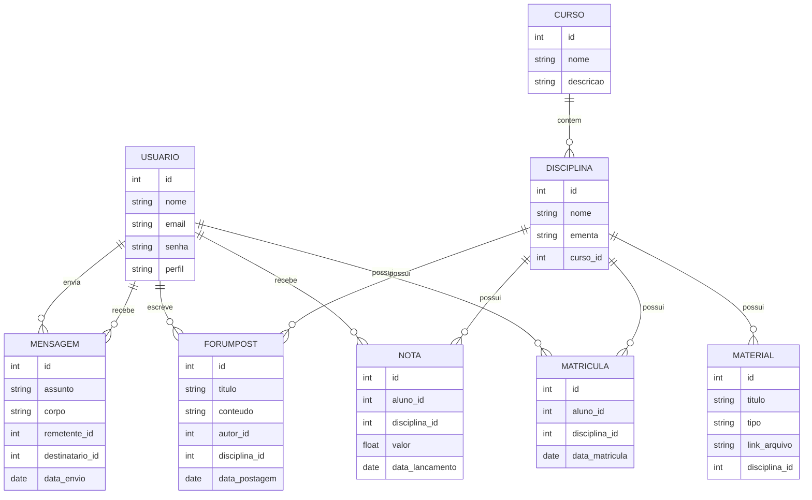

```mermaid
erDiagram

  USUARIO {
    int id
    string nome
    string email
    string senha
    string perfil
  }

  CURSO {
    int id
    string nome
    string descricao
  }

  DISCIPLINA {
    int id
    string nome
    string ementa
    int curso_id
  }

  MATRICULA {
    int id
    int aluno_id
    int disciplina_id
    date data_matricula
  }

  MATERIAL {
    int id
    string titulo
    string tipo
    string link_arquivo
    int disciplina_id
  }

  NOTA {
    int id
    int aluno_id
    int disciplina_id
    float valor
    date data_lancamento
  }

  FORUMPOST {
    int id
    string titulo
    string conteudo
    int autor_id
    int disciplina_id
    date data_postagem
  }

  MENSAGEM {
    int id
    string assunto
    string corpo
    int remetente_id
    int destinatario_id
    date data_envio
  }

  USUARIO ||--o{ MATRICULA : possui
  USUARIO ||--o{ NOTA : recebe
  USUARIO ||--o{ FORUMPOST : escreve
  USUARIO ||--o{ MENSAGEM : envia
  USUARIO ||--o{ MENSAGEM : recebe

  CURSO ||--o{ DISCIPLINA : contem
  DISCIPLINA ||--o{ MATRICULA : possui
  DISCIPLINA ||--o{ MATERIAL : possui
  DISCIPLINA ||--o{ NOTA : possui
  DISCIPLINA ||--o{ FORUMPOST : possui

```
